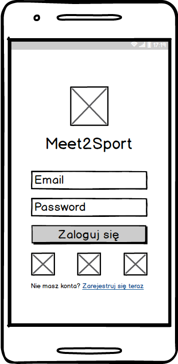
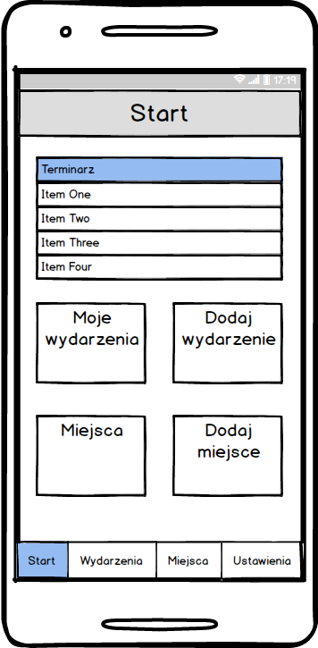
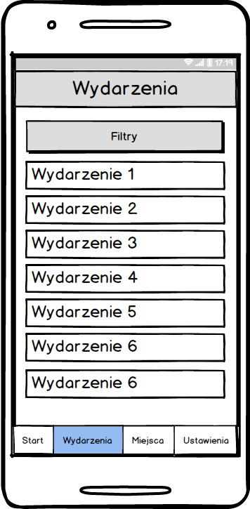
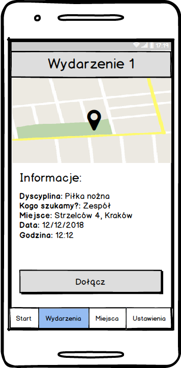
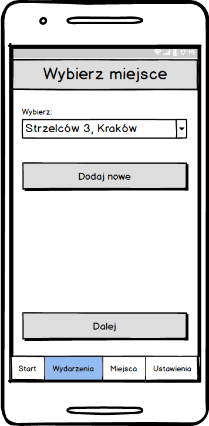
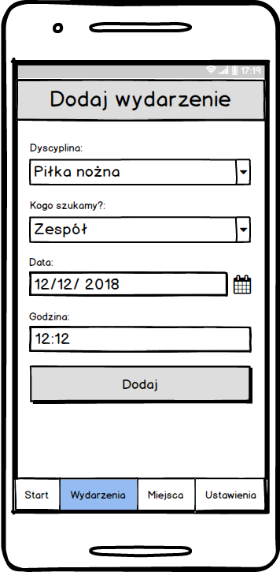
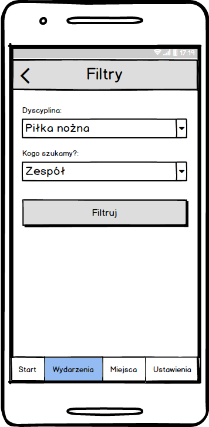
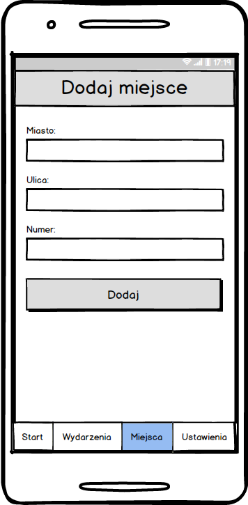

# Meet2Sport
 
## Instalacja:
1. `git clone https://github.com/mligeziak/meet2sport.git --config core.autocrlf=false`
1. Zainstaluj yarn z linku https://yarnpkg.com/en/docs/install
1. W wierszu poleceń przejdź do katalogu z projektem
1. Uruchom `yarn install`
1. Uruchom emulator lub podłącz telefon do komputera
1. Uruchom `yarn run android`
 
## Skład zespołu:
* Przemysław Nikiel, 187598, KrDUIs1012
* Rafał Kwiecień, 187161, KrDUIs1012
* Michał Ligęza, 187226, KrDUIs1012 - kierownik projektu
* Kamil Maj, 187319, KrDUIs1012
 
## Opis aplikacji i funkcjonalność:
Projekt ma na celu stworzenie aplikacji społecznościowej, dzięki której użytkownik będzie mógł znaleźć osoby do wspólnej rozgrywki w swój ulubiony sport. Za pomocą intuicyjnego interfejsu osoba korzystająca z aplikacji będzie mogła zgłosić poszukiwanie osób do wspólnej gry lub też przejrzeć istniejące ogłoszenia o odbywających się potyczkach w danej miejscowości. Dzięki tej funkcjonalności znacznie łatwiej będzie można znaleźć inne osoby, które zmierzą się z nami w najpopularniejszych grach zespołowych (piłka nożna, siatkówka, koszykówka). Aplikacja będzie posiadała również możliwość zgłoszenia lokalnego zespołu, który poszukuje rywala do sprawdzenia swoich umiejętności. Inną funkcjonalnością Meet2Sport będzie możliwość przejrzenia i rozszerzenia listy miejsc, gdzie można bezpiecznie uprawiać sport oraz ocena odzwierciedlająca faktyczną atrakcyjność danej lokalizacji.
 
Uwierzytelnianie użytkowników aplikacji będzie przeprowadzone za pomocą Firebase. W projekcie zostanie wykorzystane Google Maps API oraz inne popularne komponenty i biblioteki. Całość zostanie zbudowana w oparciu o framework React Native.
 
 
 ## Prototypy
 
 

 
 
 
 

 
### Raport
| Michał Ligęza | Przemysław Nikiel |  Rafał Kwiecień |  Kamil Maj   |
| ------------- |:-----------------:| :--------------:| :----------: |
| Projektowanie layoutu i funkcjonalności aplikacji - 2h | Projektowanie layoutu i funkcjonalności aplikacji - 2h | Projektowanie layoutu i funkcjonalności aplikacji - 2h | Projektowanie layoutu i funkcjonalności aplikacji - 2h |
| Prototypowanie aplikacji -3h | Prototypowanie aplikacji -3h | Prototypowanie aplikacji -3h | Prototypowanie aplikacji - 3h |
| Konfiguracja react-native -4h | Konfiguracja react-native -4h | Konfiguracja react-native -4h | Konfiguracja react-native  10h |
| Front-end rejestracji - 2h | Wygląd aplikacji - 4h | Front-end podglądu wydarzenia -5h | Front-end listy wydarzeń - 4h |
| Back-end logowania i rejestracji - 8h | Frontend dodawania wydarzeń - 4h| Dołączenie API Google Maps - 4h | README (Strona o projekcie) - 2h|
| Powiązanie wydarzenia z miejscem 4h | Frontend dodawania miejsc - 2h | Front-end listy wydarzeń - 3h |  |
| Back-end dodawania wydarzenia - 3h | Lista uczestników - 3h  | Front-end listy miejsc - 3h |  |
| Back-end dodawnia miejsca - 3h | | Powiązanie wydarzenia z miejscem - 4h |  |
| Front-end logowania - 2h|  |  |  |
| Obsługa Firebase - 9h |  |  | |
